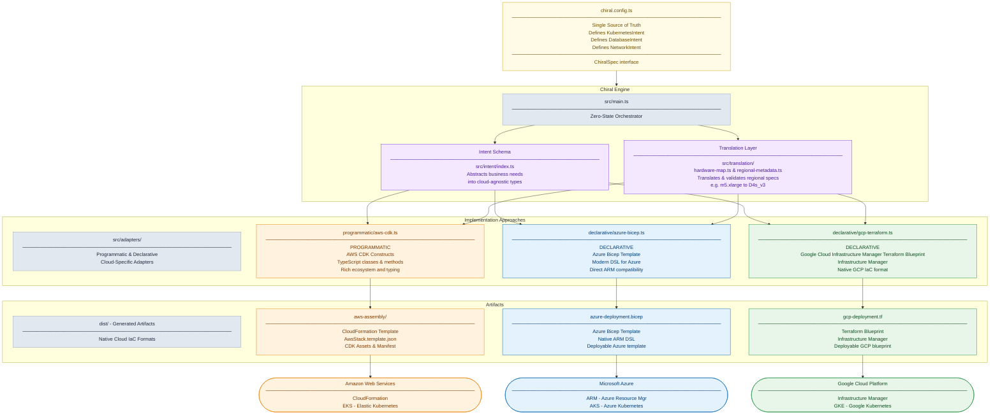

# Chiral Infrastructure as Code

**One Intent, Many Clouds: Native IaC Generation**

> **Solving [multi-cloud infrastructure's enterprise challenges](docs/CHALLENGES.md)**: Different native cloud IaCs, state management complexity, and third-party vendor lock-in make functionally uniform deployments across AWS, Azure, and GCP challenging. **Chiral generates native cloud artifacts from a single intent schema**, ensuring functional uniformity through optimal trade-offs.

---

## Installation

```bash
npm install -g chiral-infrastructure-as-code
```

## Optional Dependencies

Chiral works without any optional dependencies, but certain features provide enhanced functionality when additional tools are installed:

### Cost Analysis Tools

**Azure Cost Analysis (azure-cost-cli):**
```bash
# Install for enhanced Azure cost estimation
npm install -g azure-cost-cli
# Or install via cargo if you have Rust
cargo install azure-cost-cli
```

**AWS/GCP Cost Analysis (infracost):**
```bash
# Install for enhanced AWS and GCP cost estimation  
curl -fsSL https://raw.githubusercontent.com/infracost/infracost/master/scripts/install.sh | sh
```

### Cloud Provider CLIs

**AWS CLI:**
```bash
# macOS
brew install awscli
# Or via pip
pip install awscli
```

**Azure CLI:**
```bash
# macOS
brew install azure-cli
# Or via script
curl -L https://aka.ms/InstallAzureCli | bash
```

**Google Cloud CLI:**
```bash
# macOS
brew install google-cloud-sdk
# Or via script
curl https://sdk.cloud.google.com | bash
```

## Usage

Create a config file (e.g., `chiral.config.ts`):

> 💡 **Tip**: The reference configuration is available in `./chiral.config.ts` (the source of truth). Copy and modify as needed for your environment.

**For development (minimal example):**
```typescript
import { ChiralSystem } from './src/intent';

export const config: ChiralSystem = {
  projectName: 'myproject',
  environment: 'dev',
  networkCidr: '10.0.0.0/16',
  
  k8s: {
    version: '1.35',
    minNodes: 1,
    maxNodes: 3,
    size: 'small' // Resolves to t3.small (AWS) / Standard_B1s (Azure) / e2-small (GCP)
  },
  
  postgres: {
    engineVersion: '18.3',
    size: 'small', // Resolves to db.t3.small (AWS) / Standard_B1s (Azure) / db-g1-small (GCP)
    storageGb: 20
  },
  
  adfs: {
    size: 'small', // Resolves to t3.small (AWS) / Standard_B1s (Azure) / e2-small (GCP)
    windowsVersion: '11 26H2 Build 26300.7877'
  }
};
```

**Complete reference configuration:**

<details>
<summary>📄 View full <a href="./chiral.config.ts">chiral.config.ts</a></summary>

```typescript
// File: chiral.config.ts

// 4. The DNA (Configuration)

// The Single Source of Truth for the deployment.

import { ChiralSystem } from './src/intent';

export const config: ChiralSystem = {
  projectName: 'identity-platform',
  environment: 'prod',
  networkCidr: '10.0.0.0/16',

  // Optional: Configure regions for each cloud (defaults will be used if not specified)
  region: {
    aws: 'us-east-1',      // Default: from CDK env vars
    azure: 'East US',      // Default: resourceGroup().location
    gcp: 'us-central1'     // Default: us-central1
  },

  // Optional: Configure network settings (defaults will be calculated if not specified)
  network: {
    subnetCidr: '10.0.1.0/24'  // Default: calculated from networkCidr (/16 -> /24)
  },

  k8s: {
    version: '1.35',
    minNodes: 2,
    maxNodes: 5,
    size: 'large' // Resolves to m5.large (AWS) / Standard_D4s_v3 (Azure) / n1-standard-2 (GCP)
  },

  postgres: {
    engineVersion: '18.3',
    size: 'large', // Resolves to db.m5.large (AWS) / Standard_D4s_v3 (Azure) / db-custom-2-4096 (GCP)
    storageGb: 100
  },

  adfs: {
    size: 'large', // Resolves to m5.xlarge (AWS) / Standard_D4s_v3 (Azure) / n1-standard-2 (GCP)
    windowsVersion: '11 26H2 Build 26300.7877'
  }
};
```

</details>

**Key Features:**
- **minNodes/maxNodes**: Controls Kubernetes cluster sizing and autoscaling bounds
- **Autoscaling**: All clouds support automatic scaling within configured limits
- **Environment-aware**: Production vs development configurations

Run the CLI:

```bash
chiral --config config.js
```

This generates:
- `aws-assembly/` (Directory of CDK and CloudFormation Template)
- `azure-deployment.bicep` (Azure Bicep Template)
- `gcp-deployment.tf` (GCP Terraform Blueprint)

### Cost Analysis

Chiral provides built-in cost estimation capabilities to help you understand infrastructure costs before deployment:

```bash
# Estimate costs for all clouds
chiral cost-estimate --config chiral.config.ts

# Analyze existing infrastructure costs
chiral cost-analyze --provider azure --subscription "my-subscription"

# Detailed cost breakdown with azure-cost-cli integration
chiral cost-estimate --config chiral.config.ts --detailed --provider azure
```

**Cost Analysis Features:**
- **Real-time pricing**: Uses azure-cost-cli for Azure, infracost for AWS/GCP, and cloud provider APIs
- **Multi-cloud comparison**: Compare costs across AWS, Azure, and GCP
- **Cost optimization**: Get recommendations for cost-effective configurations
- **Budget alerts**: Set cost thresholds and receive warnings
- **Resource breakdown**: Detailed cost analysis by resource type

### Prerequisites
- **Node.js**: 18+ required
- **Cloud CLIs**: Optional but recommended for validation and deployment
- For AWS deployment: AWS CLI (`aws`)
- For Azure deployment: Azure CLI (`az`)
- For GCP deployment: Google Cloud CLI (`gcloud`)
- For cost analysis (Azure): azure-cost-cli (optional, for enhanced cost estimation)
- For cost analysis (AWS/GCP): infracost (optional, for enhanced cost estimation)

### Deployment

The `compile` command generates artifacts for all configured clouds. Deploy using native tools:

**AWS**: Use CloudFormation CLI or CDK CLI
**Azure**: Use Azure CLI with Bicep or deployment stacks for production
**GCP**: Use Terraform CLI or Infrastructure Manager

```bash
npx ts-node src/main.ts import -s path/to/your/infrastructure.tf -p aws -o chiral.config.ts
```

### Terraform Import Workflow

Chiral provides a **complete Terraform import workflow** that enables migration **FROM** Terraform **TO** Chiral Infrastructure as Code. The workflow parses existing Terraform configurations and converts them into cloud-agnostic Chiral intent.

#### Core Features
- **Complete HCL Parser**: Parse Terraform `.tf` files and extract resource definitions
- **Resource Mapping**: Convert AWS/Azure/GCP resources to Chiral intent
- **Progressive Migration**: Stateless generation with migration metadata
- **Production Ready**: 96.5% test coverage with integration tests

#### Quick Start
```typescript
import { TerraformImportAdapter } from './src/adapters/declarative/terraform-adapter';

// Import existing Terraform infrastructure
const chiralSystem = await TerraformImportAdapter.importFromTerraform({
  provider: 'aws',
  sourcePath: './my-terraform-project'
});
```

#### Supported Resources
- **AWS**: EKS clusters, RDS databases, EC2 instances, VPC networks
- **Azure**: AKS clusters, PostgreSQL servers, VM instances, Virtual networks
- **GCP**: GKE clusters, Cloud SQL databases, Compute instances, VPC networks

#### Workflow Process
1. **Parse Terraform Files**: Extract resource blocks from `.tf` files
2. **Convert to Chiral Intent**: Map cloud-specific resources to abstract intent
3. **Complete Import**: Generate full ChiralSystem with migration metadata

#### Test Coverage
- **Unit Tests**: 244/244 tests passing (100% success rate)
- **Integration Tests**: 17/17 test suites passing
- **Overall Success Rate**: 100%

For detailed documentation, see **[TERRAFORM_IMPORT_WORKFLOW.md](docs/TERRAFORM_IMPORT_WORKFLOW.md)**.

### Terraform Migration Interface

Chiral provides a Terraform migration interface designed to help teams escape Terraform's state management issues and adopt Chiral's stateless, native cloud IaC approach.

#### Migration Analysis & Planning

```bash
# Analyze your Terraform setup for risks and migration readiness
chiral analyze --source terraform/ --provider aws

# Get detailed migration strategy information
chiral migrate --source terraform/ --provider aws --analyze-only
```

The analysis includes:
- **State File Corruption Detection**: Identifies corrupted or incomplete state files
- **Security Risk Assessment**: Detects sensitive data exposure in state files
- **Dependency Analysis**: Maps resource relationships and dependencies
- **Cost Comparison**: Compares Terraform Premium costs vs Chiral's zero-cost approach
- **Migration Strategy Recommendations**: Suggests appropriate migration approaches

#### Migration Strategies

Chiral supports three migration strategies:

**Greenfield Migration** (Recommended for new environments):
```bash
chiral migrate --source terraform/ --provider aws --strategy greenfield
```
- Complete migration in one operation
- Lowest risk for simple setups
- Requires full infrastructure recreation

**Progressive Migration** (Recommended for production):
```bash
chiral migrate --source terraform/ --provider aws --strategy progressive
```
- Migrate resources incrementally by type
- Can run Terraform and Chiral in parallel
- Higher safety but more complex coordination

**Parallel Migration** (Recommended for mission-critical systems):
```bash
chiral migrate --source terraform/ --provider aws --strategy parallel
```
- Deploy Chiral infrastructure alongside existing Terraform
- Use load balancers for traffic switching
- Highest safety with extended testing periods

#### Migration Workflow

1. **Analysis Phase**:
   ```bash
   chiral analyze --source terraform/ --provider aws --cost-comparison
   ```

2. **Strategy Selection & Planning**:
   ```bash
   chiral migrate --source terraform/ --provider aws --strategy progressive --analyze-only
   ```

3. **Migration Execution**:
   ```bash
   chiral migrate --source terraform/ --provider aws --strategy progressive --output my-chiral-config.ts
   ```

4. **Validation & Deployment**:
   ```bash
   chiral validate --config my-chiral-config.ts
   chiral --config my-chiral-config.ts
   # Deploy using cloud-native tools
   ```

#### Key Benefits

- **Zero State Management**: Eliminates all Terraform state corruption, locking, and security risks
- **Native Cloud IaC**: Generates optimal IaC for each cloud using their preferred tools
- **Cost Savings**: No Terraform Premium fees ($0.99/resource/month)
- **Enhanced Security**: No sensitive data in external state files
- **Compliance Ready**: Built-in compliance features without state complexity
- **Multi-Cloud Consistency**: Single configuration drives all cloud deployments

#### Migration Safety Features

- **Rollback Planning**: Automatic generation of rollback procedures for each migration step
- **Health Checks**: Continuous validation during migration process
- **Dependency Mapping**: Intelligent ordering of resource migrations
- **Parallel Safety**: Ability to run both systems during transition
- **Gradual Rollout**: Traffic switching capabilities for zero-downtime migrations

#### Before Migration Checklist

- [ ] Backup all Terraform state files
- [ ] Document critical resource dependencies and business requirements
- [ ] Test Chiral configuration generation with sample resources
- [ ] Set up monitoring and alerting for migration period
- [ ] Ensure team training on Chiral concepts and workflows
- [ ] Plan rollback procedures for each migration phase
- [ ] Validate security and compliance requirements are met

#### Post-Migration Benefits

- **Operational Simplicity**: No state file management or lock coordination
- **Developer Productivity**: Focus on business logic, not IaC complexity
- **Cost Reduction**: Eliminate third-party state management fees
- **Security Enhancement**: Infrastructure secrets stay within cloud boundaries
- **Compliance Improvement**: Native cloud audit trails and compliance controls

The Terraform migration interface transforms Chiral from an IaC generation tool into a **complete migration solution** for teams wanting to escape the complexity and risks of Terraform state management.

### Enhanced Migration & Multi-Format Support

Chiral now provides migration support for multiple IaC tools and enhanced capabilities:

#### Multi-Format IaC Import
```bash
# Import from various IaC formats
chiral import -s terraform.tfstate -p aws -o config.ts  # Terraform state
chiral import -s main.tf -p aws -o config.ts             # Terraform HCL
chiral import -s Pulumi.yaml -p aws -o config.ts         # Pulumi YAML
chiral import -s template.json -p aws -o config.ts       # CloudFormation
chiral import -s azuredeploy.bicep -p azure -o config.ts # Bicep
```

### Terraform Import Adapter

Chiral provides a **Terraform Import Adapter** that analyzes existing Terraform HCL configurations and converts them to Chiral intent, enabling seamless migration from Terraform to Chiral's stateless approach.

#### Import Process

1. **Parse Terraform HCL**: Analyzes `.tf` files in the source directory
2. **Extract Resources**: Identifies infrastructure components (EKS, RDS, EC2, etc.)
3. **Map to Chiral Intent**: Converts cloud-specific resources to Chiral's abstract intent schema
4. **Generate Configuration**: Creates a Chiral config file ready for multi-cloud generation

#### Supported Resource Types

**AWS Resources:**
- `aws_eks_cluster` → K8s cluster configuration (version, node groups)
- `aws_db_instance` → PostgreSQL database (engine version, instance class, storage)
- `aws_instance` → ADFS/Windows VM (instance type)
- `aws_vpc` → Network CIDR configuration

**Azure Resources:**
- `azurerm_kubernetes_cluster` → AKS cluster (version, node pools)
- `azurerm_postgresql_flexible_server` → PostgreSQL (version, SKU, storage)
- `azurerm_windows_virtual_machine` → ADFS VM (VM size)
- `azurerm_virtual_network` → Network CIDR configuration

**GCP Resources:**
- `google_container_cluster` → GKE cluster (version, node pools, machine types)
- `google_sql_database_instance` → Cloud SQL PostgreSQL (version, tier, storage)
- `google_compute_instance` → Compute Engine VM (machine type)
- `google_compute_network` → VPC network configuration

#### Usage Examples

```bash
# Import AWS Terraform configuration
chiral import -s ./terraform/aws-infra/ -p aws -o aws-config.ts

# Import Azure Terraform configuration  
chiral import -s ./terraform/azure-infra/ -p azure -o azure-config.ts

# Import GCP Terraform configuration
chiral import -s ./terraform/gcp-infra/ -p gcp -o gcp-config.ts
```

#### Generated Chiral Configuration

The import adapter produces a complete Chiral system configuration:

```typescript
export const config: ChiralSystem = {
  projectName: 'imported-infrastructure',
  environment: 'prod',
  networkCidr: '10.0.0.0/16',
  k8s: {
    version: '1.35',
    minNodes: 2,
    maxNodes: 5,
    size: 'medium'
  },
  postgres: {
    engineVersion: '15',
    size: 'medium',
    storageGb: 100
  },
  adfs: {
    size: 'medium',
    windowsVersion: '2022'
  },
  migration: {
    strategy: 'progressive',
    sourceState: './terraform/',
    validateCompliance: true
  }
};
```

#### Technical Implementation

The Terraform Import Adapter includes a custom HCL parser that handles basic Terraform syntax without external dependencies:

**HCL Parsing Strategy:**
- Regex-based resource block detection
- Support for string, numeric, array, and boolean values
- Nested block parsing for complex resource configurations
- Error handling for malformed HCL files

**Test Suite Enhancements:**
- Real Terraform file creation and parsing validation
- Temporary file management with automatic cleanup
- Resource mapping verification
- Error handling and edge case testing
- HardwareMap Integration: Unified hardware mapping system for consistent instance type resolution across all cost analysis modules

#### Recent Improvements

**Version 0.0.0** - Latest Updates:
- HardwareMap Integration: Unified hardware mapping system for consistent instance type resolution across all cost analysis modules
- Enhanced AWS Pricing: Added support for m5.large instances in cost estimation
- TypeScript Fixes: Resolved compilation errors and improved type safety
- Resource Mapping: Improved AWS, Azure, and GCP resource detection and mapping
- Error Handling: Better error messages and graceful failure handling

#### Import Adapter Features

- **Custom HCL Parsing**: Uses regex-based parsing for robust handling of Terraform HCL syntax without external dependencies
- **Smart Resource Mapping**: Automatically maps cloud-specific instance types and configurations to Chiral workload sizes
- **Validation**: Ensures imported configurations meet Chiral's intent schema requirements
- **Migration Metadata**: Includes migration strategy and compliance validation settings
- **Multi-Cloud Ready**: Imported configurations can be used to generate artifacts for any supported cloud
- **Testing**: Test suite validates actual HCL parsing and resource mapping with real Terraform files

#### Limitations

- **HCL Parsing**: Uses regex-based parsing; complex nested expressions or advanced HCL features may require manual adjustment
- **Resource Coverage**: Supports common infrastructure patterns; custom resources may need manual mapping
- **Dependencies**: Does not currently import resource dependencies or complex relationships
- **Variables**: Does not resolve Terraform variables; uses default values or inferred settings

#### Next Steps After Import

Once imported, use the generated configuration for multi-cloud generation:

```bash
# Generate artifacts for all clouds
chiral compile -c imported-config.ts -o dist

# Deploy to specific cloud
cd dist/aws-assembly && cdk deploy
az deployment group create --resource-group my-rg --template-file azure-deployment.bicep
gcloud infra-manager deployments apply projects/my-project/locations/global/deployments/my-deployment --git-source-repo=https://github.com/my-org/my-repo --git-source-directory=dist
```

#### Pulumi Migration Support
```bash
# Analyze and migrate from Pulumi projects
chiral migrate -s ./pulumi-project -p aws --iac-tool pulumi --analyze-only
chiral migrate -s ./pulumi-project -p aws --iac-tool pulumi
```

**Pulumi Analysis Features:**
- Project configuration parsing (`Pulumi.yaml`)
- Language runtime detection (TypeScript, Python, Go, C#)
- Backend configuration review
- State file detection and security analysis
- Resource complexity assessment

#### FedRAMP and GovRAMP Compliance

Chiral provides compliance validation for federal and state government cloud requirements:

**Supported Frameworks:**
- **FedRAMP**: Low, Moderate, High impact levels
- **GovRAMP**: Low, Moderate, High impact levels (formerly StateRAMP)

**Key Compliance Features:**
- Government cloud region validation (AWS GovCloud, Azure Government, GCP Government)
- Encryption at rest and in transit requirements
- Audit logging and monitoring controls
- Data residency and sovereignty checks
- High availability and disaster recovery requirements

**Example FedRAMP Moderate Configuration:**
```typescript
export const config: ChiralSystem = {
  projectName: 'federal-system',
  environment: 'prod',
  networkCidr: '10.1.0.0/16',
  
  region: {
    aws: 'us-gov-east-1',      // GovCloud required
    azure: 'usgovvirginia',    // Azure Government
    gcp: 'us-gov-central1'     // GCP Government
  },
  
  compliance: {
    framework: 'fedramp-moderate',
    encryptionAtRest: true,
    auditLogging: true,
    dataResidency: {
      aws: 'us-gov-east-1',
      azure: 'usgovvirginia',
      gcp: 'us-gov-central1'
    }
  },
  
  k8s: {
    version: '1.35',
    minNodes: 2,               // High availability required
    maxNodes: 5,
    size: 'medium'
  },
  
  postgres: {
    engineVersion: '15',
    size: 'medium',
    storageGb: 100            // Minimum 50GB for Moderate
  },
  
  adfs: {
    size: 'medium',
    windowsVersion: '2022'
  }
};
```

For detailed compliance guidance, see **[FEDRAMP_GOVRAMP_COMPLIANCE.md](docs/FEDRAMP_GOVRAMP_COMPLIANCE.md)**.

#### Healthcare Compliance (HIPAA, HITRUST CSF, HITECH)

Chiral provides compliance validation for healthcare data protection requirements:

**Supported Frameworks:**
- **HIPAA**: Low, Moderate, High impact levels (Health Insurance Portability and Accountability Act)
- **HITRUST CSF**: Low, Moderate, High impact levels (Health Information Trust Alliance Common Security Framework)
- **HITECH**: Low, Moderate, High impact levels (Health Information Technology for Economic and Clinical Health Act)

**Key Healthcare Compliance Features:**
- PHI (Protected Health Information) data protection controls
- Enhanced audit logging for healthcare data access
- Network segmentation and security requirements
- Data residency and sovereignty for healthcare data
- High availability requirements for patient care systems
- Breach notification and prevention controls
- Enhanced monitoring for healthcare workloads

**Example HIPAA High Configuration:**
```typescript
export const config: ChiralSystem = {
  projectName: 'healthcare-system',
  environment: 'prod',
  networkCidr: '192.168.0.0/16',  // Non-default network for PHI
  
  region: {
    aws: 'us-east-1',           // Healthcare-compliant regions
    azure: 'eastus',
    gcp: 'us-central1'
  },
  
  compliance: {
    framework: 'hipaa-high',
    encryptionAtRest: true,      // Required for PHI
    auditLogging: true,          // Enhanced PHI access logging
    dataResidency: {
      aws: 'us-east-1',
      azure: 'eastus',
      gcp: 'us-central1'
    }
  },
  
  k8s: {
    version: '1.35',
    minNodes: 3,                 // High availability for patient care
    maxNodes: 10,
    size: 'medium'
  },
  
  postgres: {
    engineVersion: '15',
    size: 'large',
    storageGb: 100               // Minimum 100GB for PHI databases
  },
  
  adfs: {
    size: 'medium',              // Production ADFS sizing
    windowsVersion: '2022'
  }
};
```

**Example HITRUST CSF Moderate Configuration:**
```typescript
export const config: ChiralSystem = {
  projectName: 'healthcare-portal',
  environment: 'prod',
  networkCidr: '172.16.0.0/16',
  
  compliance: {
    framework: 'hitrust-moderate',
    encryptionAtRest: true,
    auditLogging: true,
    dataResidency: {
      aws: 'us-east-1',
      azure: 'eastus'
    }
  },
  
  k8s: {
    version: '1.35',
    minNodes: 2,
    maxNodes: 8,
    size: 'medium'
  },
  
  postgres: {
    engineVersion: '15',
    size: 'medium',
    storageGb: 50                // Minimum 50GB for HITRUST Moderate
  }
};
```

**Example HITECH High Configuration:**
```typescript
export const config: ChiralSystem = {
  projectName: 'ehr-system',
  environment: 'prod',
  networkCidr: '10.200.0.0/16',
  
  compliance: {
    framework: 'hitech-high',
    encryptionAtRest: true,      // Prevents breach notifications
    auditLogging: true,          // Enhanced breach detection
    dataResidency: {
      aws: 'us-east-1'
    }
  },
  
  k8s: {
    version: '1.35',
    minNodes: 3,                 // Enhanced availability for breach prevention
    maxNodes: 15,
    size: 'large'
  },
  
  postgres: {
    engineVersion: '15',
    size: 'large',
    storageGb: 75                // Minimum 75GB for breach investigation
  }
};
```

**Healthcare Compliance Validation:**
```bash
# HIPAA compliance validation
chiral validate -c chiral.config.ts --compliance hipaa-low
chiral validate -c chiral.config.ts --compliance hipaa-moderate
chiral validate -c chiral.config.ts --compliance hipaa-high

# HITRUST CSF compliance validation
chiral validate -c chiral.config.ts --compliance hitrust-low
chiral validate -c chiral.config.ts --compliance hitrust-moderate
chiral validate -c chiral.config.ts --compliance hitrust-high

# HITECH compliance validation
chiral validate -c chiral.config.ts --compliance hitech-low
chiral validate -c chiral.config.ts --compliance hitech-moderate
chiral validate -c chiral.config.ts --compliance hitech-high
```

For detailed healthcare compliance guidance, see **[HEALTHCARE_COMPLIANCE.md](docs/HEALTHCARE_COMPLIANCE.md)**.

#### Enhanced CLI Commands

**Cost Analysis:**
```bash
# Multi-cloud cost comparison
chiral cost-compare -c chiral.config.ts

# Analyze existing infrastructure costs
chiral cost-analyze --provider azure --subscription "my-sub"
```

**Configuration Validation:**
```bash
# Validate configuration and compliance
chiral validate -c chiral.config.ts --compliance soc2

# FedRAMP and GovRAMP compliance validation
chiral validate -c chiral.config.ts --compliance fedramp-low
chiral validate -c chiral.config.ts --compliance fedramp-moderate
chiral validate -c chiral.config.ts --compliance fedramp-high
chiral validate -c chiral.config.ts --compliance govramp-low
chiral validate -c chiral.config.ts --compliance govramp-moderate
chiral validate -c chiral.config.ts --compliance govramp-high

# Full compliance and deployment readiness check
chiral validate -c chiral.config.ts --compliance fedramp-moderate --deployment-check
```

**Terraform Provider:**
```bash
# Build and generate Terraform provider
chiral terraform-provider --build
chiral terraform-provider --example
```

#### Bridge Mode for Gradual Migration
```bash
# Terraform bridge with state delegation
chiral migrate -s terraform/ -p aws --terraform-bridge

# Pulumi bridge with state delegation  
chiral migrate -s pulumi-project/ -p aws --pulumi-bridge --iac-tool pulumi
```

### Documentation

For detailed documentation of all enhanced features including migration workflows, troubleshooting guides, and integration examples, see **[ENHANCED_FEATURES.md](./ENHANCED_FEATURES.md)**.

This covers:
- Advanced Terraform & Pulumi migration strategies
- Multi-format IaC import capabilities
- Cost analysis and optimization
- Compliance validation frameworks
- Bridge modes for gradual migration
- Troubleshooting and integration examples

### Terraform Provider Integration

Chiral provides a **Terraform Provider** for seamless integration with existing Terraform workflows, allowing you to use Chiral's multi-cloud capabilities directly within Terraform configurations.

#### Building the Provider

```bash
# Build the Go-based Terraform Provider
chiral terraform-provider --build

# Generate example Terraform configuration
chiral terraform-provider --example
```

#### Terraform Provider Features

- **Multi-Cloud Generation**: Single Terraform resource generates artifacts for AWS, Azure, and GCP
- **Intent-Driven**: Uses Chiral's intent schema for consistent infrastructure across clouds
- **State Management**: Leverages each cloud's native state management (no Terraform state files)
- **Cost Estimation**: Built-in cost analysis and optimization recommendations

#### Example Terraform Configuration

```hcl
terraform {
  required_providers {
    chiral = {
      source  = "chiral-io/chiral"
      version = "~> 1.0"
    }
  }
}

resource "chiral_kubernetes_cluster" "main" {
  config = {
    project_name = "my-app"
    environment  = "dev"
    k8s = {
      version      = "1.35"
      min_nodes    = 1
      max_nodes    = 3
      size         = "small"
    }
    postgres = {
      engine_version = "18.3"
      size           = "small"
      storage_gb     = 20
    }
    adfs = {
      size            = "small"
      windows_version = "11 26H2 Build 26300.7877"
    }
  }
}
```

#### Bridge Options

For gradual migration, Chiral supports bridge configurations that delegate state management to cloud providers while maintaining Terraform compatibility:

```bash
# Generate Terraform with AWS CloudFormation state delegation
chiral migrate --source terraform/ --provider aws --terraform-bridge

# Generate Pulumi with cloud-native state delegation  
chiral migrate --source pulumi-project/ --provider aws --pulumi-bridge --iac-tool pulumi
```

#### Bridge Benefits

- **Gradual Migration**: Transition incrementally from Terraform/Pulumi to Chiral
- **State Delegation**: CloudFormation/ARM/Infrastructure Manager handles state
- **Parallel Operation**: Run both systems during transition period
- **Zero Downtime**: Maintain service availability during migration

### Requirements

- Node.js
- For AWS deployment: AWS CDK CLI (`cdk`)
- For Azure deployment: Azure CLI (`az`)
- For GCP deployment: Google Cloud CLI (`gcloud`)
- For cost analysis (Azure): azure-cost-cli (optional, for enhanced cost estimation)
- For cost analysis (AWS/GCP): infracost (optional, for enhanced cost estimation)

### Deployment

- For AWS authentication: AWS CLI (`aws`)
- For Azure authentication: Azure CLI (`az`)
- For GCP authentication: Google Cloud CLI (`gcloud`)
* **Note:** You do not use `terraform` commands directly to deploy via the CLI for Google Infrastructure Manager. Instead, you use the `gcloud` CLI commands, and Infrastructure Manager runs the necessary Terraform operations (`init`, `plan`, `apply`) internally on your behalf in a managed Cloud Build environment. [The specific command to preview a deployment is](https://docs.cloud.google.com/infrastructure-manager/docs/preview-deployment) `gcloud infra-manager previews`.

---

### How
We use the Chiral Pattern to avoid vendor lock-ins to 3rd-party state managers. We use a centralized source (Intent Schema) and the Chiral Engine to generate 1st-party distributions (Native Cloud Artifacts) targeting AWS, Azure, GCP.


---

## Name: The Chiral Pattern

**Definition:** A multi-cloud infrastructure design where an intent schema is compiled simultaneously into non-superimposable, native intermediary artifacts for each cloud platform.

### The 3 Laws of Chirality
1. **Shared DNA:** There is only one source of truth (The *ChiralSpec*).
2. **Native Cloud Separation:** AWS, Azure, and GCP outputs are generated separately.
3. **Zero State:** The Chiral Engine never stores state; it only emits artifacts.

### Description
The Chiral Pattern is a software design approach for multi-cloud infrastructure management where an intent schema is used to generate native, 1st-party artifacts for each target cloud. 

The pattern produces mirror-image outputs (for example, AWS CloudFormation via CDK and Azure Bicep / Google Cloud Infrastructure Manager Terraform Blueprint) to ensure that both deployments share the same functional intent while remaining fully compatible with their respective cloud-native constructs. The Chiral Pattern allows cloud independence, auditability, and synchronization, enabling teams to change intent without relying on 3rd-party state managers to avoid vendor lock-ins.

Its metaphorical name emphasizes that the outputs are structurally identical in purpose but inherently distinct in implementation, like left and right hands.


---

> We define our infrastructure in the **Chiral Config**. The **Chiral Engine** generates the native **Enantiomers** (for example, AWS CDK, AWS CloudFormation, Azure Bicep, Azure Resource Manager, Google Cloud Infrastructure Manager Terraform Blueprints), which are then deployed to their respective clouds.

---

## The Core Metaphor (Why it works)

**Chirality** (from Greek *kheir*, "hand") is the property of an object being non-superimposable on its mirror image.

*   **The Problem:** Your AWS EKS cluster, Azure AKS cluster, and GCP GKE cluster are mirror images. They do the exact same thing (orchestrate containers).
*   **The Reality:** They are **non-superimposable**. You cannot overlay an AWS CloudFormation onto Azure Bicep or GCP Terraform. The APIs, IAM roles, and networking constructs simply do not line up.
*   **The Solution:** You need a **Chiral Engine**—a central logic core that understands the shared DNA but generates the distinct programmatic "left-handed" (AWS) and declarative "right-handed" (Azure and/or GCP) artifacts.

---

## Chiral Design Philosophy

### Core Principles
1. **Single DNA**: Intent schema drives all outputs
2. **Native Separation**: Each cloud gets its preferred native IaC format
3. **Zero State**: No external state management or databases

### Key Concepts
- **Enantiomers**: Mirror-image outputs like left/right-handed molecules
- **Intent-Driven**: Business requirements abstracted from cloud specifics
- **Artifact Generation**: Compile intent into native cloud templates
- **No 3rd-party Lock-in**: Avoid 3rd-party state managers; use each cloud's best IaC and native state manager

### Why It Works
- **Uniform**: Same intent produces functionally identical infrastructure
- **Auditability**: Direct generation from code, no hidden state
- **Evolution**: Change intent once, update all clouds simultaneously
- **Vendor Independence**: Each cloud's native tools, not generic compromises

### Pattern Benefits
- Eliminates drift between multi-cloud deployments
- Reduces complexity of managing different IaC tools
- Enables true infrastructure portability
- Maintains each cloud's optimization and features
- Intent-driven discipline: Forces separation of business requirements from technical implementation

The philosophy embraces cloud diversity while striving for functional uniformity through intent.

For a deeper dive into **why multi-cloud infrastructure management is fundamentally challenging** and how Chiral addresses these structural difficulties, see [docs/CHALLENGES.md](docs/CHALLENGES.md).

### Native Artifacts

Chiral produces native cloud artifacts that can be deployed independently: AWS CDK and CloudFormation for AWS, Azure Bicep for Azure, and Google Cloud Infrastructure Manager (Terraform Blueprint) for GCP. These are standard cloud templates that work with native cloud tooling, with GCP's Terraform Blueprint leveraging Infrastructure Manager for state-managed deployment, avoiding traditional Terraform state issues.

**Autoscaling Support:**
- **AWS EKS**: Auto-scaling node groups with `minSize`/`maxSize` from intent
- **Azure AKS**: Auto-scaling agent pools with `minCount`/`maxCount` from intent  
- **GCP GKE**: Auto-scaling node pools with `min_node_count`/`max_node_count` from intent

**State Management Considerations:**
- **AWS CDK/CloudFormation**: Managed natively by AWS; no external state files required.
- **Azure Bicep/ARM**: Handled by Azure Resource Manager; built-in consistency and rollback.
- **GCP Infrastructure Manager**: Google Cloud Infrastructure Manager runs Terraform as a managed service. Users deploy via Terraform configurations or Blueprints without directly handling state. The service handles state storage, locking, and policy enforcement, reducing operational and compliance overhead. Core Terraform risks, such as shared mutable state and partial apply failures, remain but are managed by Google rather than by individual teams. See [docs/CHALLENGES.md](docs/CHALLENGES.md) for details on these structural risks.

## Chiral vs Terraform State Management

Chiral eliminates the fundamental state management problems that make Terraform challenging at scale:

| **Terraform State Problem** | **Chiral Solution** |
|----------------------------|---------------------|
| **State Corruption** - Concurrent modifications, partial applies, network issues can corrupt state files requiring manual recovery | **Zero State Architecture** - No state files to corrupt. Each cloud manages its own state natively |
| **Lock Contention** - Multiple pipelines compete for state locks, causing orphaned locks and manual intervention | **Native Cloud Locking** - AWS CloudFormation, Azure ARM, and Google Cloud Infrastructure Manager handle locking automatically |
| **Backend Management** - Complex setup and maintenance of Amazon S3, Azure Storage, Google Cloud Storage backends with encryption, versioning, and access controls | **No Backend Required** - Each cloud's native service handles state storage, versioning, and security automatically |
| **Security Risks** - State files contain sensitive data (secrets, IPs, metadata) that can leak or be exposed | **No External State Files** - Sensitive information stays within each cloud's secure control plane |
| **Multi-Account Spanning** - State files cannot securely span cloud accounts without breaking trust boundaries | **Native Cloud Security** - Each cloud's IAM and security controls manage state within their trust boundaries |
| **Cost Overhead** - Google Cloud Infrastructure Manager costs $0.99/month per resource plus operational overhead for state management | **Zero Additional Cost** - No third-party state management fees or operational overhead |

### Terraform Migration Benefits

**From Problematic Terraform Approaches:**
- **A. Local State**: Single point of failure and security risks
- **B. Remote Backend per Environment**: Backend complexity and lock contention
- **C. Coarse-Grained State**: Blast radius from state file corruption
- **D. Self-Managed Terraform**: [Manage and Secure the Underlying Network and Infrastructure](https://developer.hashicorp.com/terraform/enterprise/deploy/reference/application-security)
- **E. Managed Terraform**: [$0.99/resource/month fees](https://www.hashicorp.com/en/pricing) and [remaining state issues]()

**To Chiral's Stateless Approach:**
- Generate native artifacts from single intent
- Deploy with each cloud's optimal tools
- Zero state management overhead
- Built-in security and compliance
- True multi-cloud consistency

### Migration Path

```bash
# Import existing Terraform configurations
npx ts-node src/main.ts import -s path/to/infrastructure.tf -p aws -o chiral.config.ts

# Generate stateless native artifacts
chiral --config chiral.config.ts

# Deploy with cloud-native tools (no Terraform state required)
cd dist/aws-assembly && cdk deploy
az deployment group create --resource-group my-rg --template-file azure-deployment.bicep
gcloud infra-manager blueprints apply --gcp-deployment.tf
```

## How Chiral Compares to Traditional Multi-Cloud Tools

Chiral takes a different approach to multi-cloud infrastructure management compared to traditional IaC tools:

### Multi-Cloud Synchronization
- **Single intent change**: Modify intent once → generates AWS CDK and CloudFormation, Azure Bicep, and Google Cloud Infrastructure Manager (Terraform Blueprint)
- **Reduced coordination**: Reduces the need to manually keep multiple cloud templates in sync
- **Regenerate artifacts**: Change intent → regenerate all artifacts → deploy to clouds

### Infrastructure Management
- **No state files**: Traditional IaC requires managing complex state (e.g., CDK context.json)
- **No lock files**: No dealing with state locking, drift detection, or reconciliation
- **No cleanup**: Artifacts are pure functions of intent - no orphaned resources or manual cleanup

### Developer Experience
- **Intent-first coding**: Write business requirements, not cloud-specific APIs
- **Type safety**: TypeScript type validation
- **Framework handles complexity**: You focus on "what", Chiral handles "how" across clouds

---

## Implementation Approaches: Programmatic vs Declarative

### Programmatic Approach (AWS CDK)
**Purpose**: The primary approach - most feature-rich, developer-friendly IaC

**Characteristics**:
- Programmatic constructs (classes, methods)
- Rich ecosystem and tooling
- Strong typing and validation
- Complex logic capabilities

**Current**: AWS CDK (most mature programmatic IaC) → CloudFormation (declarative output)

**Why AWS CDK is programmatic**: CDK is AWS's primary IaC tool, even though it generates declarative CloudFormation. This reflects AWS's ecosystem where programmatic CDK is preferred over raw CloudFormation templates.

**Ideal**: CDK-equivalent tools (TypeScript/Python-based, construct libraries)

### Declarative Approaches (Azure Bicep, Google Cloud Infrastructure Manager Terraform)
**Purpose**: Generate native declarative artifacts optimized for each cloud

**Characteristics**:
- DSL or template-based syntax
- Cloud-native validation
- Simple deployment workflows
- Direct API compatibility

**Current**:
- Azure Bicep (modern declarative DSL)
- Google Cloud Infrastructure Manager Terraform Blueprint (Infrastructure Manager)

**Azure Enhancements**:
- Uses Azure Verified Modules (AVM) for standardized, production-ready deployments
- Integrates azure-cost-cli for real-time cost estimation during generation
- Supports deployment stacks for complete mode in production environments

**Ideal**: Each cloud's best native IaC format (Bicep for Azure, Terraform for GCP)

### Selection Criteria

**For Programmatic Approach:**
- Does it have rich programmatic APIs?
- Can it generate complex infrastructure?
- Is it the most mature tool for its cloud?

**For Declarative Approaches:**
- Is it the cloud's recommended native format?
- Does it integrate best with cloud APIs?
- Is it optimized for that cloud's features?

### Design Principles

1. **Single Intent → Multiple Natives**: One config drives each cloud's best IaC
2. **No Compromises**: Use each cloud's strongest tool, not lowest common denominator
3. **Asymmetric by Design**: Programmatic vs declarative reflect different IaC philosophies, not equal capabilities
4. **Evolve Independently**: Each approach can change tools as clouds evolve

The key is maintaining the intent-driven approach while letting each cloud use its optimal IaC paradigm.

---

## Examples

The `examples/` directory provides practical guides for implementing the Chiral pattern:

- **`basic-setup/`**: Contains a minimal example for setting up a new Chiral project from scratch, including simple configuration and intent interfaces.
- **`bicep-to-chiral/`**: Guide for converting Azure Bicep templates to the Chiral pattern.
- **`cdk-to-chiral/`**: Guide for converting AWS CDK stacks to the Chiral pattern.
- **`gcp-to-chiral/`**: Guide for converting GCP Infrastructure Manager templates to the Chiral pattern.
- **`tofu-to-chiral/`**: Demonstrates how to convert OpenTofu projects to the Chiral pattern, extracting business intent and enabling multi-cloud generation.
- **`pulumi-to-chiral/`**: Guide for converting Pulumi programs to the Chiral pattern.
- **`terraform-to-chiral/`**: Guide for converting Terraform configurations to the Chiral pattern.

---

## Implementation Terminology

When writing your code, use these specific terms to reinforce the pattern:

*   **Intent Schema:** The abstract TypeScript interface defining what you want (e.g., `interface ChiralSystem`).
*   **Adapters:** The cloud-specific implementations that translate intent into native IaC formats.
*   **Synthesis:** The process of running the engine. You don't "deploy" directly—you **generate** artifacts, then deploy the native results.

## About the Chiral Metaphor

This project is named after the "Chiral Pattern" - a chemistry concept where molecules exist in left-handed and right-handed forms that are mirror images but cannot be superimposed. 

**However, the metaphor is imperfect when applied to concrete cloud resources.** While programmatic (CDK) and declarative (Bicep/Terraform) approaches achieve the same functional goals, they produce fundamentally different architectures:

- **CDK → CloudFormation**: AWS-native constructs that leverage AWS-specific APIs and services
- **Bicep → ARM Templates**: Azure-native resource definitions optimized for Azure Resource Manager
- **Terraform → Blueprint**: Provider-agnostic declarations that get translated to cloud-specific APIs

These approaches don't "superimpose" on concrete cloud resources - they produce different architectural patterns, different API calls, and different deployment lifecycles. The value lies in abstracting the **intent** (what you want) while allowing each cloud to use its optimal **implementation approach** (how to achieve it).

---

## Pipeline Summary

We define our infrastructure in the **Intent Schema**. Our **Chiral Engine** generates native artifacts using **Programmatic** (AWS CDK) and **Declarative** (Azure Bicep, Google Cloud Infrastructure Manager Terraform) approaches, which are then deployed to their respective clouds.

---

## Mermaid Diagram



---


---

## Open-source software

https://github.com/lloydchang/chiral-infrastructure-as-code

---

## License

[GNU Affero General Public License v3.0 or later](https://github.com/lloydchang/chiral-infrastructure-as-code/blob/main/LICENSE)
