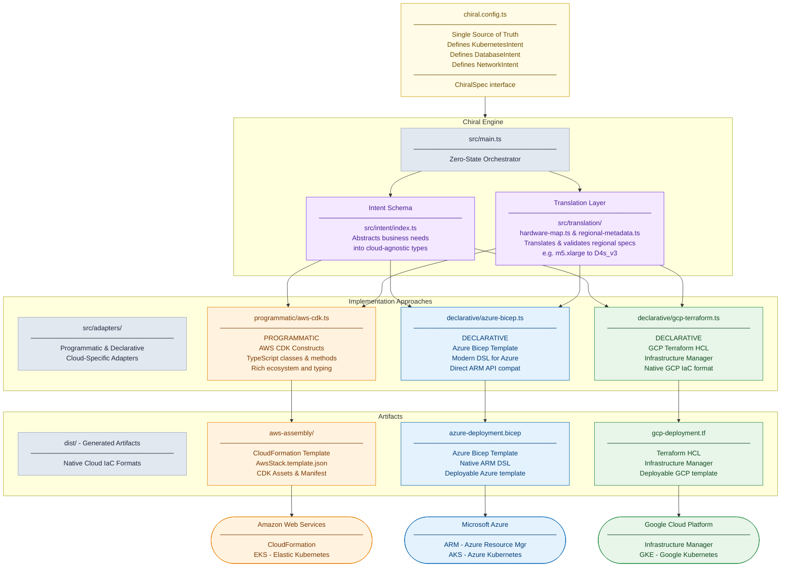

# Chiral Infrastructure as Code

**One Intent, Many Clouds: Optimized Enterprise Deployments**

> **Solving multi-cloud infrastructure's enterprise challenges**: Different native cloud IaCs, state management complexity, and third-party vendor lock-in make consistent deployments across AWS, Azure, and GCP extremely difficult. **Chiral generates native cloud artifacts from a single intent schema**, ensuring consistency through optimal trade-offs.

---

## Installation

```bash
npm install -g chiral-infrastructure-as-code
```

## Usage

Create a config file (e.g., `config.js` or `config.ts`):

```javascript
module.exports = {
  projectName: 'myproject',
  environment: 'dev',
  networkCidr: '10.0.0.0/16',
  k8s: {
    version: '1.28',
    minNodes: 1,
    maxNodes: 3,
    size: 'small'
  },
  postgres: {
    engineVersion: '15',
    storageGb: 20,
    size: 'small'
  },
  adfs: {
    size: 'small',
    windowsVersion: '2022'
  }
};
```

Run the CLI:

```bash
chiral --config config.js
```

This generates:
- `aws-assembly/` (CloudFormation templates)
- `azure-deployment.bicep` (Azure Bicep)
- `gcp-deployment.tf` (GCP Terraform HCL)

### Requirements

- Node.js
- For Azure validation: Azure CLI (`az`)
- For AWS deployment: AWS CDK CLI (`cdk`)

---

### Elevator Pitch
We use the Chiral Pattern to avoid vendor lock-ins to 3rd-party state managers. We use a centralized source (Intent Schema) and the Chiral Engine to generate 1st-party distributions (Native Cloud Artifacts) targeting AWS, Azure, GCP.


---

## Name: The Chiral Pattern

**Definition:** A multi-cloud infrastructure design where an intent schema is compiled simultaneously into non-superimposable, native intermediary artifacts for each cloud platform.

### The 3 Laws of Chirality
1. **Shared DNA:** There is only one source of truth (The *ChiralSpec*).
2. **Native Cloud Separation:** AWS, Azure, and GCP outputs are generated separately.
3. **Zero State:** The Chiral Engine never stores state; it only emits artifacts.

### Description
The Chiral Pattern is a software design approach for multi-cloud infrastructure management where an intent schema is used to generate native, 1st-party artifacts for each target cloud. 

The pattern produces mirror-image outputs (for example, AWS CloudFormation via CDK and Azure Bicep) to ensure that both deployments share the same functional intent while remaining fully compatible with their respective cloud-native constructs. The Chiral Pattern allows cloud independence, auditability, and synchronization, enabling teams to change intent without relying on 3rd-party state managers to avoid vendor lock-ins.

Its metaphorical name emphasizes that the outputs are structurally identical in purpose but inherently distinct in implementation, like left and right hands.


---

> We define our infrastructure in the **Chiral Config**. The **Chiral Engine** generates the native **Enantiomers** (for example, CloudFormation and Bicep), which are then deployed to their respective clouds.

---

## The Core Metaphor (Why it works)

**Chirality** (from Greek *kheir*, "hand") is the property of an object being non-superimposable on its mirror image.

*   **The Problem:** Your AWS EKS cluster, Azure AKS cluster, and GCP GKE cluster are mirror images. They do the exact same thing (orchestrate containers).
*   **The Reality:** They are **non-superimposable**. You cannot overlay an AWS CloudFormation onto Azure Bicep or GCP Terraform. The APIs, IAM roles, and networking constructs simply do not line up.
*   **The Solution:** You need a **Chiral Engine**—a central logic core that understands the shared DNA but generates the distinct programmatic "left-handed" (AWS) and declarative "right-handed" (Azure and/or GCP) artifacts.

---

## Chiral Design Philosophy

### Core Principles
1. **Single DNA**: Intent schema drives all outputs
2. **Native Separation**: Each cloud gets its preferred native IaC format
3. **Zero State**: No external state management or databases

### Key Concepts
- **Enantiomers**: Mirror-image outputs like left/right-handed molecules
- **Intent-Driven**: Business requirements abstracted from cloud specifics
- **Artifact Generation**: Compile intent into native cloud templates
- **No 3rd-party Lock-in**: Avoid 3rd-party state managers; use each cloud's best IaC and native state manager

### Why It Works
- **Consistency**: Same intent produces functionally identical infrastructure
- **Auditability**: Direct generation from code, no hidden state
- **Evolution**: Change intent once, update all clouds simultaneously
- **Vendor Independence**: Each cloud's native tools, not generic compromises

### Pattern Benefits
- Eliminates drift between multi-cloud deployments
- Reduces complexity of managing different IaC tools
- Enables true infrastructure portability
- Maintains each cloud's optimization and features
- Intent-driven discipline: Forces separation of business requirements from technical implementation

The philosophy embraces cloud diversity while enforcing consistency through unified intent.

For a deeper dive into **why multi-cloud infrastructure management is fundamentally challenging** and how Chiral addresses these structural difficulties, see [docs/CHALLENGES.md](docs/CHALLENGES.md).

### Native Artifacts

Chiral produces native cloud artifacts that can be deployed independently: AWS CDK and CloudFormation for AWS, Azure Bicep for Azure, and GCP Infrastructure Manager (Terraform HCL) for GCP. These are standard cloud templates that work with native cloud tooling.

## How Chiral Compares to Traditional Multi-Cloud Tools

Chiral takes a different approach to multi-cloud infrastructure management compared to traditional IaC tools:

### Multi-Cloud Synchronization
- **Single intent change**: Modify intent once → generates AWS CDK and CloudFormation, Azure Bicep, and GCP Infrastructure Manager (Terraform HCL)
- **Reduced coordination**: Reduces the need to manually keep multiple cloud templates in sync
- **Regenerate artifacts**: Change intent → regenerate all artifacts → deploy to clouds

### Infrastructure Management
- **No state files**: Traditional IaC requires managing complex state (e.g., CDK context.json)
- **No lock files**: No dealing with state locking, drift detection, or reconciliation
- **No cleanup**: Artifacts are pure functions of intent - no orphaned resources or manual cleanup

### Developer Experience
- **Intent-first coding**: Write business requirements, not cloud-specific APIs
- **Built-in validation**: Automatic syntax checking and type safety
- **Framework handles complexity**: You focus on "what", Chiral handles "how" across clouds

---

## Implementation Approaches: Programmatic vs Declarative

### Programmatic Approach (AWS CDK)
**Purpose**: The primary approach - most feature-rich, developer-friendly IaC

**Characteristics**:
- Programmatic constructs (classes, methods)
- Rich ecosystem and tooling
- Strong typing and validation
- Complex logic capabilities

**Current**: AWS CDK (most mature programmatic IaC) → CloudFormation (declarative output)

**Why AWS CDK is programmatic**: CDK is AWS's primary IaC tool, even though it generates declarative CloudFormation. This reflects AWS's ecosystem where programmatic CDK is preferred over raw CloudFormation templates.

**Ideal**: CDK-equivalent tools (TypeScript/Python-based, construct libraries)

### Declarative Approaches (Azure Bicep, GCP Terraform)
**Purpose**: Generate native declarative artifacts optimized for each cloud

**Characteristics**:
- DSL or template-based syntax
- Cloud-native validation
- Simple deployment workflows
- Direct API compatibility

**Current**:
- Azure Bicep (modern declarative DSL)
- GCP Terraform HCL (Infrastructure Manager)

**Ideal**: Each cloud's best native IaC format (Bicep for Azure, Terraform for GCP)

### Selection Criteria

**For Programmatic Approach:**
- Does it have rich programmatic APIs?
- Can it generate complex infrastructure?
- Is it the most mature tool for its cloud?

**For Declarative Approaches:**
- Is it the cloud's recommended native format?
- Does it integrate best with cloud APIs?
- Is it optimized for that cloud's features?

### Design Principles

1. **Single Intent → Multiple Natives**: One config drives each cloud's best IaC
2. **No Compromises**: Use each cloud's strongest tool, not lowest common denominator
3. **Asymmetric by Design**: Programmatic vs declarative reflect different IaC philosophies, not equal capabilities
4. **Evolve Independently**: Each approach can change tools as clouds evolve

The key is maintaining the intent-driven approach while letting each cloud use its optimal IaC paradigm.

---

```text
chiral-infrastructure-as-code
├── chiral.config.ts                  # [DATA] The "DNA". Single Source of Truth.
├── dist/                             # [ARTIFACTS] The "Racemic Mixture" (Output Folder).
│   ├── aws-assembly/                 # [ASSEMBLY] Native CloudFormation and Assets.
│   │   ├── AwsStack.assets.json      # Optional if your stack has no assets.
│   │   ├── AwsStack.template.json    # [NATIVE] The deployable AWS template.
│   │   ├── manifest.json             # Metadata about the assembly, stacks, and assets.
│   │   └── tree.json                 # A tree view of the stack's construct hierarchy.
│   ├── azure-deployment.bicep        # [NATIVE] The deployable Azure Bicep enantiomer.
│   └── gcp-deployment.tf             # [NATIVE] The deployable GCP Infrastructure Manager (Terraform HCL).
├── docs/                             # Documentation and Synchronization research.
│   └── ideas/
│       ├── AWS_CDK_To_Azure_Bicep_Guide.txt
│       ├── Multi-Cloud_IaC_Synchronization_Challenges.txt
│       └── Syncing_AWS_CDK_and_Bicep.txt
├── examples/                         # [EXAMPLES] Comprehensive guides for different IaC approaches.
│   ├── basic-setup/
│   │   └── README.md
│   ├── bicep-to-chiral/
│   │   └── README.md
│   ├── cdk-to-chiral/
│   │   └── README.md
│   ├── gcp-to-chiral/
│   │   └── README.md
│   ├── tofu-to-chiral/
│   │   └── README.md
│   ├── pulumi-to-chiral/
│   │   └── README.md
│   └── terraform-to-chiral/
│       └── README.md
├── src/
│   ├── __tests__/                    # [TESTS] Unit and integration tests for adapters and synthesis.
│   │   ├── azure-adapter.test.ts
│   │   ├── gcp-adapter.test.ts
│   │   ├── hardware-map.test.ts
│   │   ├── intent.test.ts
│   │   └── synthesis-integration.test.ts
│   ├── adapters/                     # [LOGIC] Implementation approaches.
│   │   ├── programmatic/             # [PROGRAMMATIC] CDK-based imperative approach
│   │   │   └── aws-cdk.ts            # [AWS] CDK constructs and classes
│   │   └── declarative/              # [DECLARATIVE] DSL/template-based approaches
│   │       ├── azure-bicep.ts        # [AZURE] Bicep template generation
│   │       └── gcp-terraform.ts      # [GCP] Terraform HCL generation
│   ├── intent/                       # [TYPES] Abstract business requirements.
│   │   └── index.ts                  # Defines KubernetesIntent, DatabaseIntent, etc.
│   ├── rosetta/                      # [TRANSLATION] Hardware mapping between clouds.
│   │   └── hardware-map.ts           # Maps abstract sizes to cloud-specific SKUs
│   └── main.ts                       # [ENGINE] Orchestrates synthesis from intent to artifacts.
├── package.json                      # Dependencies and Scripts.
├── package-lock.json                 # Lock file for exact dependency versions.
├── tsconfig.json                     # TypeScript configuration.
└── README.md                         # Project documentation and Chiral Pattern definition.
```

---

## Examples

The `examples/` directory provides practical guides for implementing the Chiral pattern:

- **`basic-setup/`**: Contains a minimal example for setting up a new Chiral project from scratch, including simple configuration and intent interfaces.
- **`bicep-to-chiral/`**: Guide for converting Azure Bicep templates to the Chiral pattern.
- **`cdk-to-chiral/`**: Guide for converting AWS CDK stacks to the Chiral pattern.
- **`gcp-to-chiral/`**: Guide for converting GCP Infrastructure Manager templates to the Chiral pattern.
- **`tofu-to-chiral/`**: Demonstrates how to convert OpenTofu projects to the Chiral pattern, extracting business intent and enabling multi-cloud generation.
- **`pulumi-to-chiral/`**: Guide for converting Pulumi programs to the Chiral pattern.
- **`terraform-to-chiral/`**: Guide for converting Terraform configurations to the Chiral pattern.

---

## Implementation Terminology

When writing your code, use these specific terms to reinforce the pattern:

*   **Intent Schema:** The abstract TypeScript interface defining what you want (e.g., `interface ChiralSystem`).
*   **Adapters:** The cloud-specific implementations that translate intent into native IaC formats.
*   **Synthesis:** The process of running the engine. You don't "deploy" directly—you **generate** artifacts, then deploy the native results.

## About the Chiral Metaphor

This project is named after the "Chiral Pattern" - a chemistry concept where molecules exist in left-handed and right-handed forms that are mirror images but cannot be superimposed. 

**However, the metaphor is imperfect when applied to concrete cloud resources.** While programmatic (CDK) and declarative (Bicep/Terraform) approaches achieve the same functional goals, they produce fundamentally different architectures:

- **CDK → CloudFormation**: AWS-native constructs that leverage AWS-specific APIs and services
- **Bicep → ARM Templates**: Azure-native resource definitions optimized for Azure Resource Manager
- **Terraform → HCL**: Provider-agnostic declarations that get translated to cloud-specific APIs

These approaches don't "superimpose" on concrete cloud resources - they produce different architectural patterns, different API calls, and different deployment lifecycles. The value lies in abstracting the **intent** (what you want) while allowing each cloud to use its optimal **implementation approach** (how to achieve it).

---

## Pipeline Summary

We define our infrastructure in the **Intent Schema**. Our **Chiral Engine** generates native artifacts using **Programmatic** (AWS CDK) and **Declarative** (Azure Bicep, GCP Terraform) approaches, which are then deployed to their respective clouds.

---

## Mermaid Diagram


---

## Open-source software

https://github.com/lloydchang/chiral-infrastructure-as-code

---

## License

[GNU Affero General Public License v3.0 or later](https://github.com/lloydchang/chiral-infrastructure-as-code/blob/main/LICENSE)
